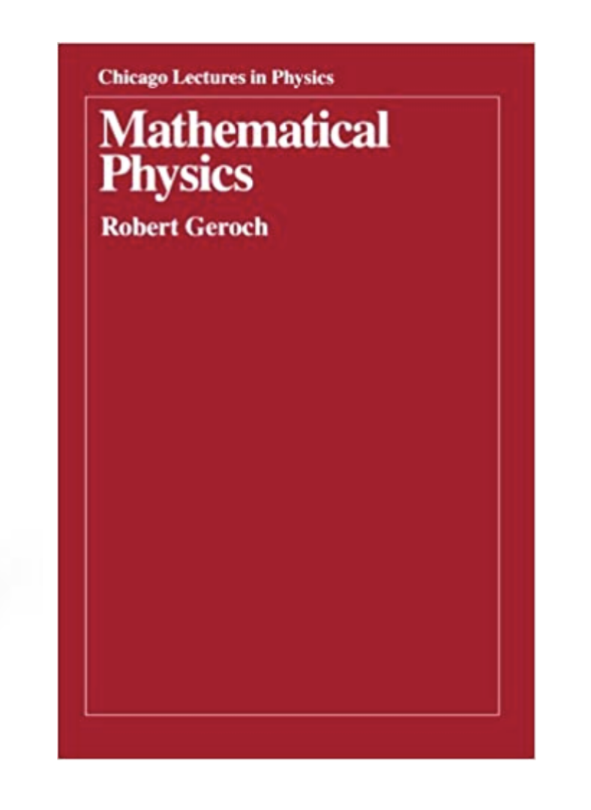
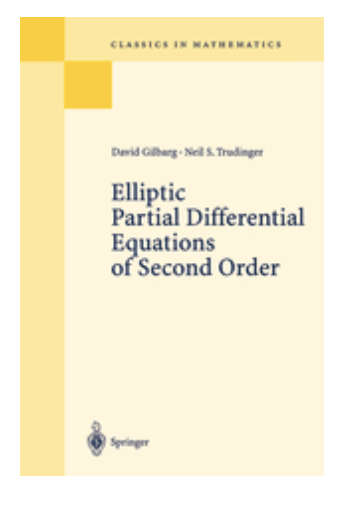
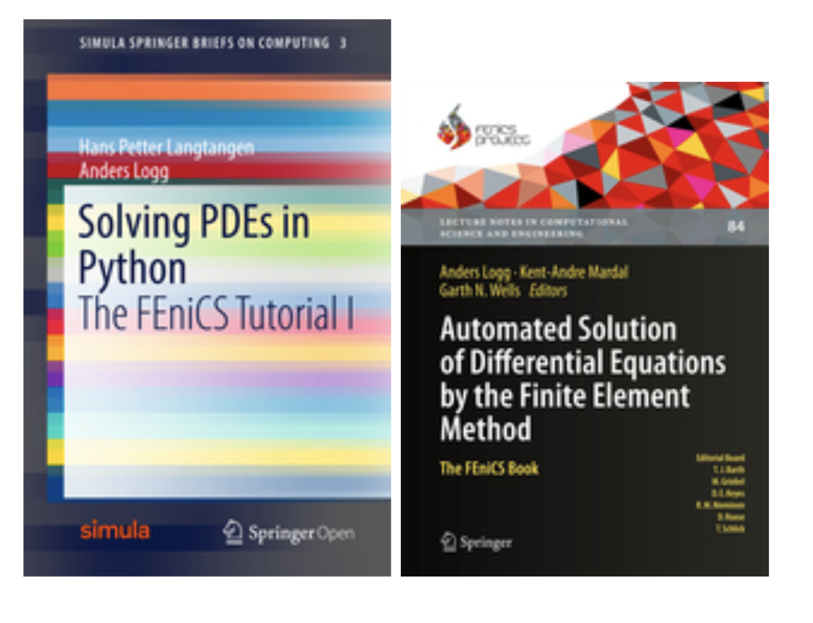

Course Bibliography

A book on mathematical methods will cover most of the analytical material in the course.

 
#### [Download from here:](https://github.com/reula/libro_metodos/blob/master/Current_garamond/libro_gar.pdf)

A book on mathematical physics which I enjoyed reading. Several chapters in the book above are inspired on it.

#### Books on Evolutionary Equations with numerical methods

#### Reviews
- Continuum and Discrete Initial-Boundary Value Problems and Einstein’s Field Equations, Oliver Sarbach & Manuel Tiglio (analytical and numerical theory, mostly hyperbolic, with applications to general relativity. Living Reviews in Relativity.

#### For elliptic theory (analitical)

#### Finite elements theory with applications in Fenix, Firedrake or Gridap.

#### Finite elements notes by D. Arnold 
[download from here](https://www-users.cse.umn.edu/~arnold/8445-8446.14-15/notes.pdf)

